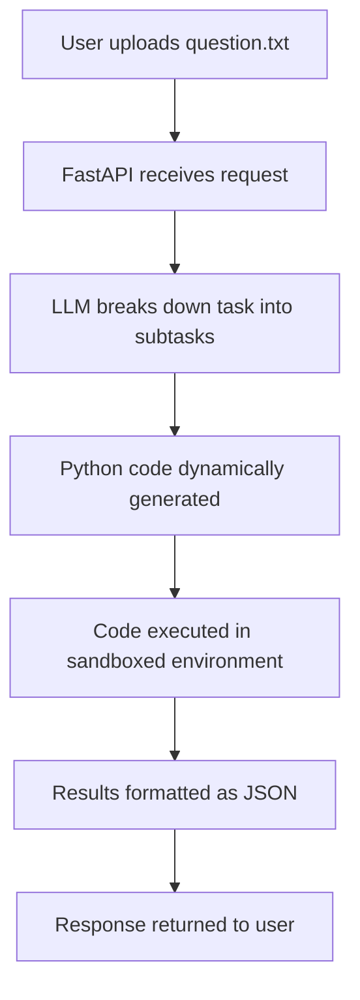

Deployed on Hugging Face at https://huggingface.co/spaces/Aditya-Darshan-G/Data_Analyst_Agent

---
title: Data Analyst Agent
emoji: 🧠
colorFrom: indigo
colorTo: blue
sdk: docker
pinned: false
app_port: 7860
---

# Data Analyst Agent

[](LICENSE)


This project implements a **Data Analyst Agent** that can interpret natural-language questions, fetch or process data, and return structured answers. It is designed for the *Tools in Data Science* course (TDS Project 2). This used to be deployed on Railway.

The agent runs as a **web service** and provides an automated workflow that:
1. Accepts a plain text query (`question.txt`) from the user.
2. Uses a large language model (LLM) to break down the task into subtasks.
3. Dynamically generates and executes Python code for each subtask.
4. Returns the final answer in a structured JSON format (plots, tables, or text, depending on the question).

---

## 🚀 Features
- **Natural Language Input**: Users provide a query in plain English (e.g., "Plot the monthly trend of stock prices for Apple").
- **Automated Task Breakdown**: The agent decomposes queries into data sourcing, analysis, and visualization steps.
- **Dynamic Code Generation**: Subtasks are executed using generated Python code in a controlled environment.
- **Flexible Output**: Responses adapt to the query (JSON objects, base64-encoded plots, tables, or text summaries).
- **Containerized Deployment**: Ready to run via Docker and deployable on Heroku.

---

## 📂 Repository Structure
- `app.py` – Main FastAPI app that handles requests and responses.
- `index.html` – Simple front-end interface for testing queries.
- `requirements.txt` – Python dependencies.
- `Dockerfile` – Containerization setup.
- `Procfile` – Deployment instructions for Heroku.
- `runtime.txt` – Python runtime version for deployment.
- `entrypoint.sh` – Script to start the application.
- `README.md` – Project documentation (this file).

---

## ⚙️ Installation & Setup

### Prerequisites
- Python 3.9+
- [Docker](https://www.docker.com/) (optional, for containerized deployment)
- An LLM API key (e.g., OpenAI, Gemini, or other local model as configured)

### Local Setup
```bash
# Clone the repository
git clone https://github.com/Aditya-Darshan-cyber/TDS-Project-2---Data-Analyst-Agent.git
cd TDS-Project-2---Data-Analyst-Agent

# Create and activate a virtual environment
python3 -m venv venv
source venv/bin/activate  # On Windows: venv\Scripts\activate

# Install dependencies
pip install -r requirements.txt

# Run the application
python app.py
```

The app will be available at `http://127.0.0.1:8000`.

### Docker Setup

```bash
# Build the Docker image
docker build -t data-analyst-agent .

# Run the container
docker run -p 8000:8000 data-analyst-agent
```

---

## 📊 Usage

1. Prepare a plain text file (`question.txt`) with your query, e.g.:

   ```
   Show me a histogram of housing prices by city.
   ```

2. Send the query to the API:

   ```bash
   curl -X POST -F "file=@question.txt" http://127.0.0.1:8000/analyze
   ```

3. Receive a JSON response with structured results.

   * If the task involves plotting, the response will include a base64-encoded image.
   * If it involves summarization, the response will be text or tables.

---

## 📌 Example Workflow



### Example

Input (`question.txt`):

```
Get the average closing price of Apple stock in 2023 and plot the monthly trend.
```

Output (JSON response):

```json
{
  "average_price": 172.54,
  "monthly_plot": "base64encodedimage==",
  "status": "success"
}
```

---

## 🛠️ Tech Stack

* **Backend**: FastAPI
* **LLM Integration**: Configurable via `.env` for API keys
* **Deployment**: Docker + Heroku
* **Language**: Python 3.9+

---

## 📜 License

This project is licensed under the MIT License.
